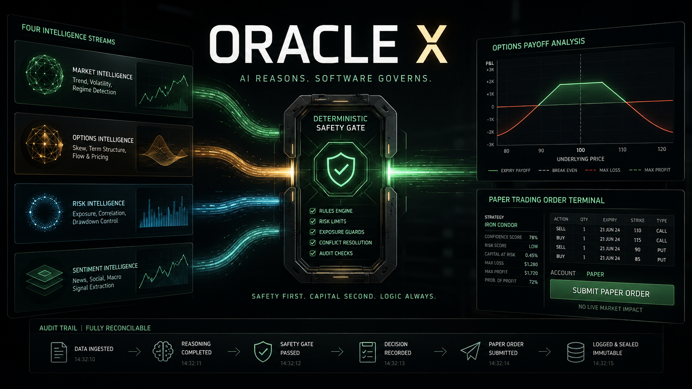

# ORACLE X

### The AI Investment Committee That Doesn't Trade on Blind Faith



ORACLE X is an autonomous, multi-agent AI trading intelligence system built for the **Alpaca AI Trading Agents Hackathon**.

Instead of trusting a single AI model to make a trading decision, ORACLE X creates an investment committee where specialized agents form a thesis, challenge it, recommend a defined-risk strategy family and interpret deterministic stress results. Deterministic services construct and calculate the actual options strategy.

A deterministic **Risk Governor** then decides whether the proposed trade is actually allowed to reach the market.

> **AI builds the case. Deterministic software governs it. Alpaca executes it. Every decision can be replayed.**

## The Committee

| Agent | Role | Core question |
|---|---|---|
| **ATHENA** | Opportunity Intelligence | Is there an interesting opportunity? |
| **HADES** | Adversarial Critic | Assume Athena is wrong. Why? |
| **HERMES** | Options Strategy Advisor | Which defined-risk strategy family best expresses the surviving thesis? |
| **MORPHEUS** | Stress-Test Interpreter | Do the deterministic stress results justify PASS, CAUTION or REJECT? |

## Safety Architecture

```text
Alpaca API + shared read-only MCP evidence
      ↓
ATHENA thesis → HADES challenge → HERMES advisory strategy family
      ↓
Deterministic Strategy Engine + Quant Service + Stress Engine
      ↓
MORPHEUS stress verdict
      ↓
Deterministic Risk Governor
      ↓
Execution Guard
      ↓
Alpaca Execution Adapter
      ↓
Alpaca
      ↓
Position lifecycle → Autopsy Service → Learning Service
```

**No LLM may directly place, modify or cancel an order.**

The hackathon implementation uses **paper trading only**.

## Technology

- **Featherless** — AI inference
- **Alpaca MCP** — agent-facing market/research tools
- **Alpaca Trading API** — controlled execution
- **Alpaca CLI** — diagnostics, automation and reconciliation
- **Python / FastAPI / Pydantic** — backend and typed contracts
- **PostgreSQL / Supabase** — system of record
- **Web frontend** — ORACLE X War Room

## Decision Replay

Every major decision is recorded:

```text
Opportunity
  ↓
Evidence
  ↓
ATHENA Thesis
  ↓
HADES Critique
  ↓
HERMES Strategy Recommendation
  ↓
Deterministic Structure + Quant + Stress
  ↓
MORPHEUS Stress Verdict
  ↓
Risk Evaluation
  ↓
Execution
  ↓
Outcome
  ↓
Autopsy Service
  ↓
Learning Service
```

The system is designed to answer **why a trade was made, why it was rejected, and what was learned afterward**.

## Repository

See `AGENTS.md` for the non-negotiable engineering contract and `CODEX-INSTRUCTIONS.md` for the implementation handoff. Database migrations are applied in order from `supabase/migrations/`.

## Current status

A working hackathon vertical slice implements the canonical typed committee, shared read-only Alpaca MCP research, five deterministic options strategies, quantitative and stress calculations, Morpheus pre-risk interpretation, separate Autopsy and Learning services, a replayable lifecycle, SQLite/PostgreSQL persistence, role-protected APIs, durable system state, Risk Governor, Execution Guard, economic-intent idempotency and reconciled paper-order submission.

## Judge quick links

- [Demo runbook](docs/DEMO.md)
- [Two-minute video script](docs/VIDEO-SCRIPT.md)
- [Submission brief](docs/SUBMISSION.md)
- [Hackathon presentation](assets/presentation/oracle-x-hackathon-deck.pptx)
- [Safety governance](AGENTS.md)

## Run the War Room

```powershell
python -m pip install -e ".[test]"
python -m uvicorn app.main:app --app-dir backend --port 8000
```

Open `http://127.0.0.1:8000`.

The default fixture mode is deterministic, clearly labelled and unable to submit orders. To connect Featherless and Alpaca, copy `.env.example` to `.env`, add server-side credentials, and keep every paper-trading safety setting enabled. See `docs/DEMO.md` for the connected and paper-execution checklist.

## Safety evidence

- Agents return advisory typed contracts and cannot import the broker execution path.
- Risk approval and final execution validation are deterministic.
- Live Alpaca endpoints are rejected during configuration validation.
- Sensitive provider hosts are allowlisted before credentials are sent.
- Fixture evidence cannot authorize a broker mutation.
- Paper execution is disabled by default and requires an explicit second operator action.
- Alpaca paper orders are submitted only after durable kill-switch/system-state checks and broker reconciliation.
- Audit events are append-only and exposed through a replay endpoint.

Run the focused safety suite with `python -m pytest -q`.

## Core philosophy

> **Don't trust one AI. Convene a committee.**

> **AI builds the case. The Governor decides whether the case is allowed to touch the market.**
